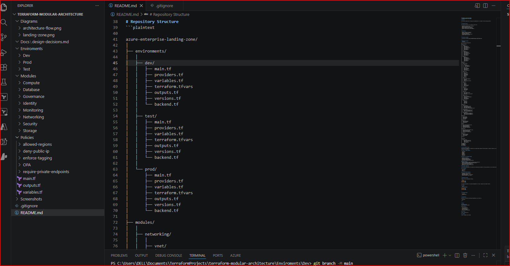
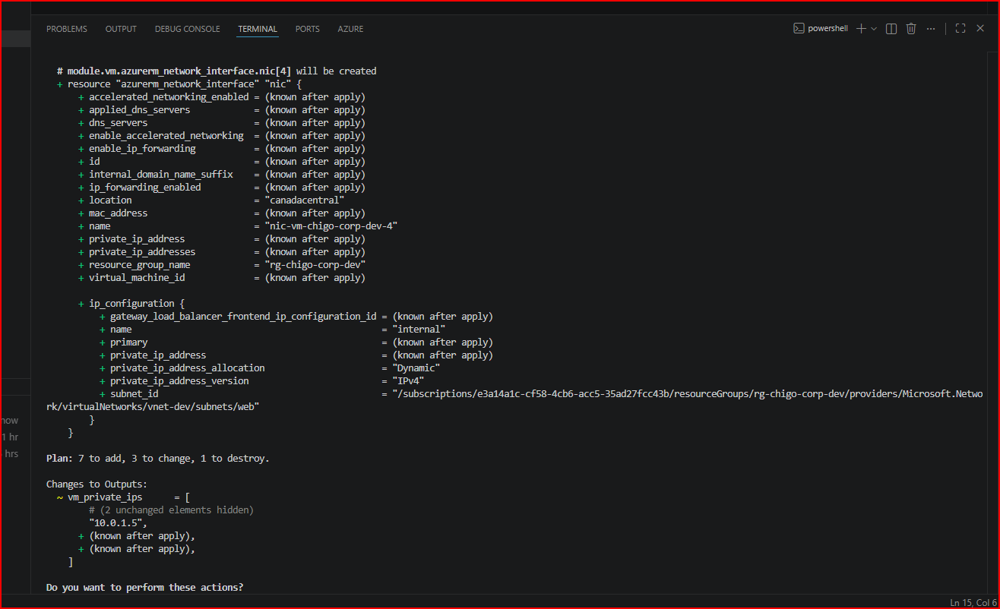
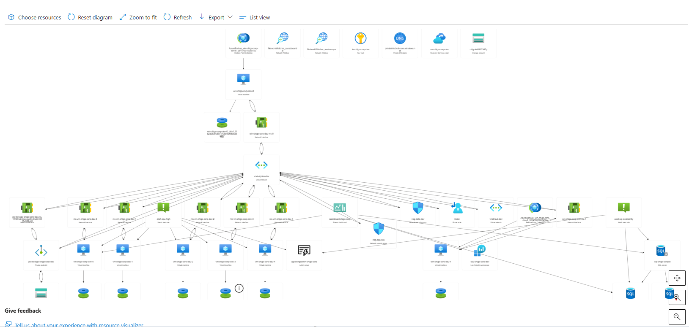

# Azure Enterprise Landing Zone with Terraform (CAF-Inspired)

Enterprise-grade Azure landing zone architecture designed using Terraform and Zero Trust principles to provide secure, scalable, governance-driven cloud foundations for modern workloads.

---

# Overview

This project demonstrates the design and implementation of a production-oriented Azure landing zone architecture using Infrastructure as Code (IaC) and modular Terraform design patterns.

The architecture focuses on:

* Security-first cloud foundations
* Infrastructure standardization
* Governance and policy enforcement
* Modular Terraform deployments
* Environment isolation
* Operational scalability
* Centralized monitoring and observability
* Cost governance and operational visibility

---

# Architecture Goals

The primary objectives of this landing zone were:

* Establish a secure Azure foundation
* Standardize infrastructure deployments
* Reduce configuration drift
* Improve governance and compliance
* Enable scalable workload onboarding
* Support Infrastructure as Code adoption
* Align with Zero Trust security principles
* Improve monitoring and operational visibility

---

# Key Features

## Infrastructure & Networking

* Modular Terraform framework for scalable Azure infrastructure deployments
* Environment-specific deployments with isolated state management
* Azure Virtual Network segmentation with subnet-level isolation
* Network Security Groups enforcing workload-level access control
* Reusable Terraform modules organized by infrastructure domain

## Security & Governance

* Azure Policy integration for governance and compliance enforcement
* Zero Trust-oriented architecture principles
* Centralized tagging and governance consistency
* Least privilege and segmentation-focused design
* Governance-driven resource deployment standards

## Monitoring & Operations

* Azure Monitor and Log Analytics integration for centralized observability
* Shared operational dashboard for infrastructure visibility
* Automated metric alerts for CPU utilization and SQL availability
* Infrastructure diagnostics and activity monitoring
* Operational visibility across VM, SQL, and cost metrics

## Cost Optimization

* Azure Budget integration with threshold-based alerting
* Centralized cost visibility and governance controls

## Engineering Practices

* Reusable Terraform module architecture
* Infrastructure-as-Code deployment workflows
* Remote backend state management with locking support
* Scalable repository structure supporting maintainability
* Environment isolation for safer deployment operations

---

# Terraform Module Architecture



Infrastructure components are organized into reusable Terraform modules to improve scalability, operational consistency, and long-term maintainability.

---

# Azure Cloud Architecture


The platform architecture integrates networking, security, monitoring, governance, and operational services into a centralized Azure landing zone model.

---

# Deployment Validation

## Terraform Apply Execution



Validated infrastructure deployment using reusable Terraform modules and Infrastructure-as-Code workflows.

## Deployed Resource Viewer



Deployed resource view in the portal resource viewer.


## Monitoring Dashboard


Centralized operational dashboard integrating:

* VM CPU monitoring
* Memory monitoring
* Disk activity monitoring
* SQL availability visibility
* Budget governance
* Security posture monitoring
* Alert visibility

---

# Repository Structure

```plaintext
azure-terraform-landing-zone/
│
├── Environments/
│   ├── Dev/
│   ├── Test/
│   └── Prod/
│
├── Modules/
│   ├── Networking/
│   ├── Security/
│   ├── Compute/
│   ├── Database/
│   ├── Monitoring/
│   ├── Governance/
│   └── Identity/
│
├── Policies/
├── diagrams/
├── docs/
├── README.md
└── .gitignore
```

---

# Terraform Module Design

Infrastructure components are organized into domain-based reusable Terraform modules to improve scalability, operational consistency, and long-term maintainability.

## Example Module Domains

* Networking
* Security
* Compute
* Database
* Monitoring
* Identity
* Governance

## Benefits of the Modular Design

* Improved reusability
* Operational consistency
* Scalable deployment patterns
* Environment standardization
* Simplified maintenance and governance

---

# Security Principles

This project aligns with Zero Trust and enterprise cloud security principles designed to reduce attack surface and improve operational visibility.

## Core Principles

* Never trust, always verify
* Least privilege access
* Assume breach
* Segmentation-first architecture
* Centralized visibility and monitoring
* Elimination of unnecessary public exposure

## Implemented Security Controls

* Network Security Groups (NSGs)
* Azure Policy enforcement
* Private networking architecture
* Resource tagging governance
* Centralized monitoring and diagnostics
* RBAC-oriented governance design

---

# Architecture Decisions

## Why Modular Terraform?

To improve scalability, reduce duplication, simplify environment management, and support reusable Infrastructure-as-Code patterns.

## Why Azure Monitor & Log Analytics?

To centralize infrastructure observability, diagnostics, operational metrics, and alert visibility.

## Why Azure Policy?

To enforce governance standards, reduce configuration drift, and maintain operational consistency.

## Why Environment Isolation?

To reduce deployment risk, improve governance boundaries, and support safer infrastructure lifecycle management.

---

# Environment Separation

Infrastructure deployments are isolated across dedicated environments to reduce operational risk and improve deployment governance.

## Environments

* Development
* Test
* Production

## Each Environment Maintains

* Independent state management
* Dedicated variables
* Environment-specific configurations
* Reduced deployment blast radius

---

# Policies & Governance

Azure Policies are organized separately from infrastructure modules to maintain clear separation between infrastructure deployment and governance enforcement.

## Example Policies

* Require resource tagging
* Restrict unsupported configurations
* Governance-driven deployment enforcement
* Resource standardization controls

This approach improves governance visibility, compliance enforcement, and operational consistency across environments.

---

# Deployment Workflow

Typical Terraform deployment workflow:

```bash
terraform init
terraform plan
terraform apply
```

Example deployment:

```bash
cd Environments/Dev

terraform init
terraform plan
terraform apply
```

---

# Technologies Used

* Microsoft Azure
* Terraform
* Azure Monitor
* Azure Log Analytics
* Azure SQL
* Azure Policy
* Azure Virtual Network
* Network Security Groups (NSGs)
* Infrastructure as Code (IaC)
* Zero Trust Architecture Principles

---

# Future Improvements

Planned enhancements include:

* CI/CD pipeline automation
* Policy-as-Code validation
* Advanced compliance monitoring
* Expanded monitoring automation
* Azure Sentinel integration
* Multi-region deployment patterns
* Automated security scanning workflows

---

# Documentation

Additional architecture and design documentation can be found in:

```plaintext
/docs
```

---

# Author

## Chigozie Iluno

Cloud & Security Architect

Specializing in:

* Azure Architecture
* Cloud Security
* Terraform Automation
* Zero Trust Design
* Infrastructure Governance

## Portfolio

https://chigoiluno.com

## LinkedIn

https://linkedin.com/in/chigoi
